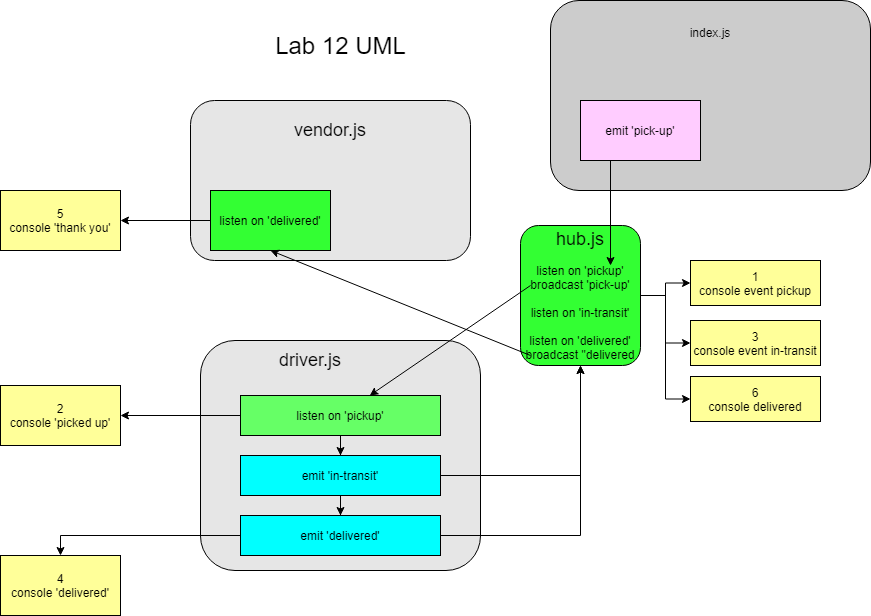

# LAB 11: CAPS

## Description

(Source: Code Fellows 401 JS Lab 12 instructions)

**CAPS Phase 2:** Continue working on a multi-day build of our delivery tracking system, moving event management to socket.io.

In this phase, we’ll be moving away from using Node Events for managing events, instead refactoring to using socket.io, which takes on some of the complexity we had to manage ourselves, and also works equally well between servers and with websites.

CAPS will simulate a delivery service where vendors (such as flower shops) will ship products using our delivery service and when our drivers deliver them, be notified that their customers received what they purchased.

- The following user/developer stories detail the major functionality for this phase of the project.

  - As a vendor, I want to alert the system when I have a package to be picked up.
  - As a driver, I want to be notified when there is a package to be delivered.
  - As a driver, I want to alert the system when I have picked up a package and it is in transit.
  - As a driver, I want to alert the system when a package has been delivered.
  - As a vendor, I want to be notified when my package has been delivered.

- And as developers, here are some of the development stories that are relevant to the above.

  - As a developer, I want to create network event driven system using Socket.io so that I can write code that responds to events originating from both servers and web applications

## Author

Ayrat Gimranov

## Collaborators

Alex White (instructor);
Tom McGuire - testing;

## Version

1.0.0

## Resources

[Code Fellows 401: JS Lab 12 starter code](https://github.com/codefellows/seattle-javascript-401n19/tree/main/class-12/starter_code)

<!-- ## Deployed Sites -->

<!-- Prod branch -- https://ayrat-auth-api-prod.herokuapp.com/
Dev branch -- https://ayrat-auth-api-dev.herokuapp.com/ -->

## UML

