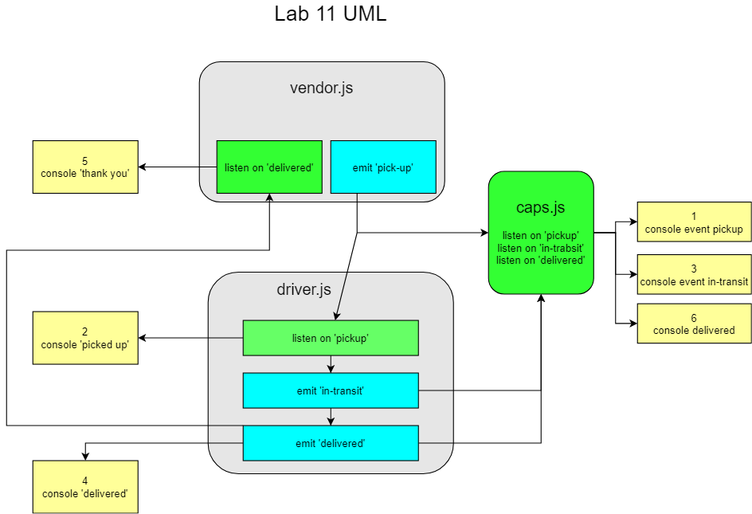

# LAB 11: CAPS

## Description

(Source: Code Fellows 401 JS Lab 11 instructions)

**CAPS Phase 1:** Begin the build of an application for a company called CAPS - The Code Academy Parcel Service. In this sprint, we’ll build out a system that emulates a real world supply chain.

CAPS will simulate a delivery service where vendors (such as flower shops) will ship products using our delivery service and when our drivers deliver them, be notified that their customers received what they purchased.

- The following user/developer stories detail the major functionality for this phase of the project.

  - As a vendor, I want to alert the system when I have a package to be picked up.
  - As a driver, I want to be notified when there is a package to be delivered.
  - As a driver, I want to alert the system when I have picked up a package and it is in transit.
  - As a driver, I want to alert the system when a package has been delivered.
  - As a vendor, I want to be notified when my package has been delivered.

- And as developers, here are some of the development stories that are relevant to the above.

  - As a developer, I want to use industry standards for managing the state of each package.
  - As a developer, I want to create an event driven system so that I can write code that happens in response to events, in real time.

## Author

Ayrat Gimranov

## Collaborators

Alex White (instructor);
Tom McGuire - testing;

## Version

1.0.0

## Resources

[Code Feloows 401: JS starter code](https://github.com/codefellows/seattle-javascript-401n19/tree/main/class-11/starter_code)

## Deployed Sites

Prod branch -- https://ayrat-auth-api-prod.herokuapp.com/
Dev branch -- https://ayrat-auth-api-dev.herokuapp.com/

## UML

